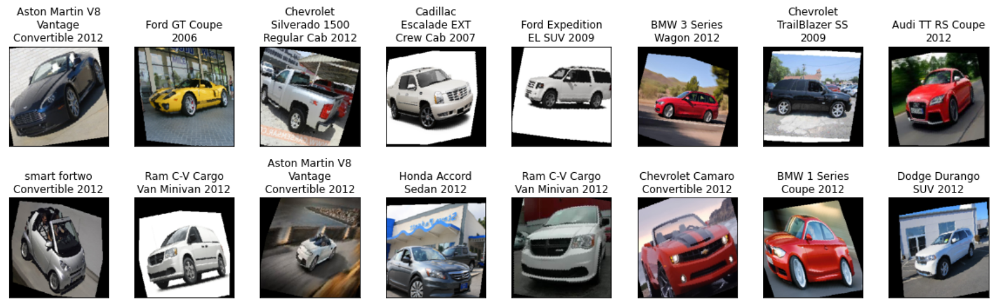
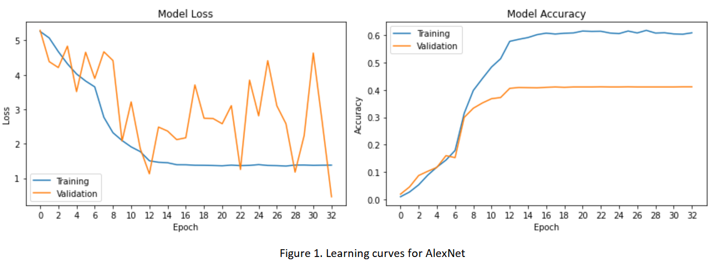
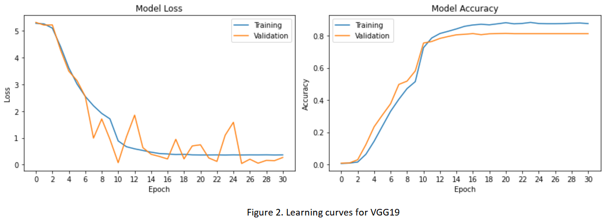
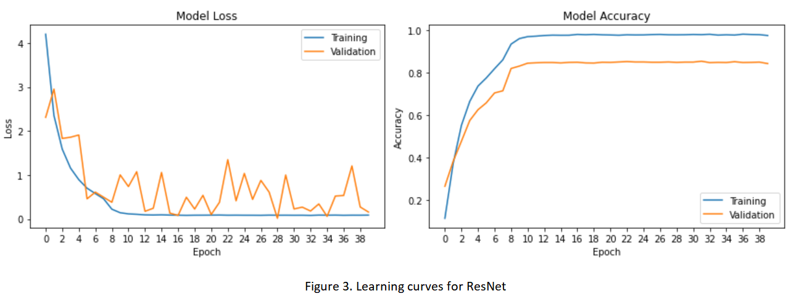
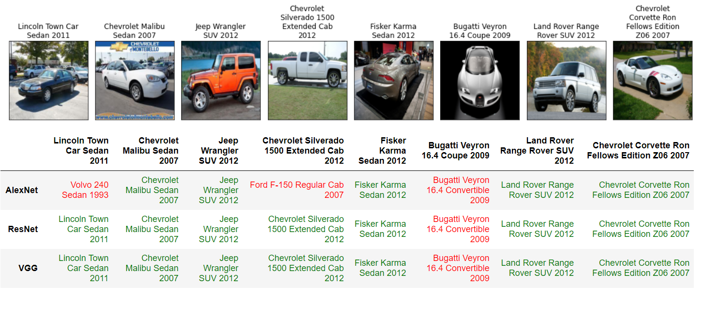

# CNN Based Car Classification

**Note:** This project was completed in Google Colab. The green-red test results cannot be shown in Github repo. Click [here](https://nbviewer.jupyter.org/github/shuang379/CNN_based_car_classification/blob/main/car_classification.ipynb) for better results display. 

## Introduction
This project is about car classification for [Stanford car dataset](https://ai.stanford.edu/~jkrause/cars/car_dataset.html). The Cars dataset contains 16,185 images of 196 classes of cars and is split into 8,144 training images (avg: 41.5 images per class) and 8,041 testing images (avg: 41.0 images per class), where each class has been split roughly in a 50-50 split. Classes are typically at the level of Make, Model, Year, e.g. 2012 Tesla Model S or 2012 BMW M3 coupe.

It is difficult to directly train deep learning model on this dataset because the limited number of images. Thus we decide to use transfer learning, a common approach used in deep learning to utilize the pretrained model on [imagenet](http://www.image-net.org/) and fine-tune on our own dataset, i.e. car dataset. 

## Image preparation 

As mentioned above, there are training images (8144) and testing images (8041). For validation purpose during the training process, I randomly split the testing data into validation and testing sets with a ratio of 1 : 4. All images were normalized before going into models.

To improve the performance and ability of the models to generalize, I applied image augmentations to **training images**, which include the followings:

- random horizontal flip
- random rotation of 15 degrees
- random horizontal and vertical shifts by 0.1
- random scaling with a range from 0.9 to 1.1

Augmented images look like below:

## Models

Three popular pre-trained models, in **PyTorch**, were used in this project, including: AlexNet, VGG19 and ResNet34. Here are the inspirations to choose these models:

- AlexNet started an era to process relatively larger color images (3 * 224 * 224), compared to previous black-white small images (1 * 32 * 32).  It was also the first time when dropout, ReLU activation function and max pooling were used in deep learning. 
- VGGNet uses smaller filters (3 * 3) and deeper networks. Compared to previous networks using large filters (11 * 11), VGGNet trains much faster.
- ResNet is a very deep network using residual connections. The residual block was brought in to deal with the vanishing gradient issue. 

## Training settings

Settings for training process are as follows:

- Validation was conducted after every epoch. Accuracies were recorded for later plotting.
- Cross entropy loss was selected as loss function. 
- The initial learning rate was set to 0.01. If the accuracy did not increase at least 0.9, learning rate will be reduced by 0.1x.
- A trained model was saved if validation accuracy of current epoch was higher than previous.
- Early stopping executed with patience of 10. The best model was reloaded for later testing.

## Results and discussions

**Model training**

Among the three models, ResNet-34 performed best while VGG-19 performed very similar. Learning curves are shown in figures 1-3. We can see overfitting for all models appeared between10 - 16 epochs. The validation accuracy from the AlexNet model was around 40% while the accuracies from the other two models were over 80%. 

If we look at figure 1, we can see the accuracy on training set was not satisfying (around 60%). This low number indicates inadequate model complexity. At the same time, the big gap between training and validation learn curves tells the poor generalization capacity. By comparing figure 2 and 3, we can see similar validation accuracies. However, the almost 100% training accuracy in figure 3 means more than enough model complexity. The model fits training data perfectly and consequently lead to the low bias problem. If we determine model based only on validation accuracy, ResNet wins even if with over complexity. 

There is one more thing we can see from these learning curves. Since there is no trending for training and validation curves to converge, add general training data may not improve model performance. However, add images for specific classes would still benefit as discussed in the "further work" section. 

**Model testing**

A holdout testing set, including 6433 images, was used to test those trained models. Accuracies are 40.3%, 80.1% and 84.6% for Alexnet, VGG-19 and ResNet-34. A sample of test images are shown below. Predictions from three models are listed in the following table. Green mean correct predictions while red means incorrect predictions. 

**Further work**

Failure analysis could be done by investigating the incorrectly predicted images. For example, the sixth image above, "Bugatti Veyron 16.4 Coupe 2009" was predicted as "Bugatti Veyron 16.4 Convertible 2009" by all three models. This could be because the high similarity of these two types of car. One way to resolve this issue is adding images of these two types of car, from different angles so that the minor differences could be learned by models. 

